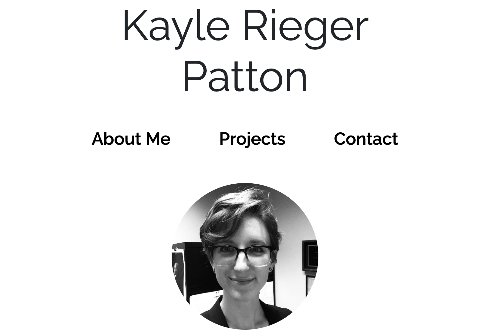

# Personal Portfolio

## Table of Contents

- [Description](#description)
  - [Technologies](#technologies)
- [Deployed Application](#deployed-application)
- [Screenshots](#screenshots)

## Description

A single page portfolio containing about me information, coding projects, and contact links.

This is my first professional portfolio highlighting my coding work and will continue to evolve as Coding Boot Camp progresses.

Project success criteria required:

- About Me, Projects, and Contact sections with relevant content
- Name and photo
- Nav bar linking to page sections
- Titled project cards with images that link to their deployed applications
- Styling which is responsive to various viewport sizes

### Technologies

- HTML
- CSS

## Deployed Application

[GitHub Pages Link](https://kayleriegerpatton.github.io/personal-portfolio/)

## Screenshots

### Laptop viewport (full page):

### Tablet viewport (header):

### Mobile viewport (card & contacts):

